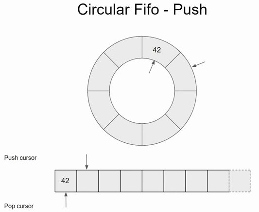

# Ering
Ering is a step-by-step implementation of a lock-free, single-producer, single-consumer, fixed-size FIFO queue

## Step 1: Simple Unsafe Circular Ring
The first step implements a basic, non-thread-safe circular buffer in C.

<div align="center">

</div>

### Code
```c
typedef struct {
    unsigned int capacity;    // Maximum number of elements
    void** ring;              // Array of void pointers
    unsigned int push_cursor; // Index for next push
    unsigned int pop_cursor;  // Index for next pop
} Ering;

// Push an element into the ring
int ering_push(Ering *const ring, void* value) {
    if ((ring->push_cursor - ring->pop_cursor) == ring->capacity)
        return 0;
    ring->ring[ring->push_cursor % ring->capacity] = value;
    ++ring->push_cursor;
    return 1;
}

// Pop an element from the ring
int ering_pop(Ering *const ring, void** value) {
    if ((ring->push_cursor - ring->pop_cursor) == 0)
        return 0;
    *value = ring->ring[ring->pop_cursor % ring->capacity];
    ++ring->pop_cursor;
    return 1;
}
```

## Step 2: Adding Atomic Operations

In this step, I introduce atomic operations to make the FIFO queue safe for a single-producer, single-consumer (SPSC) scenario. By using atomic loads and fetches, I ensure that cursor updates are visible across threads without data races.

- I use `__atomic_load` with `__ATOMIC_ACQUIRE` to read the opposing cursor (**pop_cursor** in *ering_push*, **push_cursor** in *ering_pop*). This ensures the consumer or producer sees the latest value written by the other thread. Also `__atomic_fetch_add` with `__ATOMIC_RELEASE` is used to increment **push_cursor** or **pop_cursor**
- `__ATOMIC_ACQUIRE`: This ensures that the write to the buffer (storing the value) is completed and visible to the consumer before the updated push_cursor is published.
- `__ATOMIC_RELEASE`: This ensures that the write to the buffer (storing the value) is completed and visible to the consumer before the updated push_cursor is published.

Together, acquire-release pairing establishes a happens-before relationship

<!-- <div align="center">

</div> -->

### Code
```c
int ering_push(Ering *const ring, void *const value) {
    unsigned int pop_c;
    __atomic_load(&ring->pop_cursor, &pop_c,  __ATOMIC_ACQUIRE);

    if ((ring->push_cursor - pop_c) == ring->capacity)
        return 0;
    ring->ring[ring->push_cursor % ring->capacity] = value;
    __atomic_fetch_add(&ring->push_cursor, 1, __ATOMIC_RELEASE);
    return 1;
}

int ering_pop(Ering *const ring, void **const value) {
    unsigned int push_c;
    __atomic_load(&ring->push_cursor, &push_c,  __ATOMIC_ACQUIRE);
    if ((push_c - ring->pop_cursor) == 0)
        return 0;
    *value = ring->ring[ring->pop_cursor % ring->capacity];
    __atomic_fetch_add(&ring->pop_cursor, 1, __ATOMIC_RELEASE);
    return 1;
}
```

## Step 3: Fixing False Sharing
In this step, I modify the `Ering` structure to eliminate **false sharing**.

`False sharing` occurs when multiple threads access different variables that reside on the same CPU cache line (typically 64 bytes on modern systems).

Even if the variables are logically independent (e.g., one thread writes to **push_cursor** and another reads **pop_cursor**), the CPU cache coherence protocol invalidates and reloads the entire cache line for each thread’s operation. This causes unnecessary contention, slowing down performance as threads ping-pong the cache line between CPU cores.

In the previous step, *push_cursor* and *pop_cursor* were adjacent in memory within the Ering struct. Since they’re smaller than a cache line, they often share the same 64-byte cache line. When the producer updates push_cursor and the consumer reads pop_cursor, the cache line bounces between cores, degrading throughput.

### Code
```c
#define CACHE_LINE_SIZE 64

typedef struct {
    unsigned int capacity;
    void** ring;
    __attribute__((aligned(CACHE_LINE_SIZE))) unsigned int push_cursor;
    __attribute__((aligned(CACHE_LINE_SIZE))) unsigned int pop_cursor;
} __attribute__((aligned(CACHE_LINE_SIZE))) Ering;
```

## Step 4: Optimizing Cursor Reads with Caching
In this step, I optimized the ring by reducing unnecessary atomic reads of the opposing thread’s cursor.

In the previous step, the producer always read pop_cursor (via __atomic_load) on every ering_push call to check if the queue was full, and the consumer always read push_cursor on every ering_pop call to check if it was empty. However:

- The **producer** only needs the real `pop_cursor` value when the queue appears full (i.e., push_cursor - pop_cursor == capacity).

- The **consumer** only needs the real `push_cursor` value when the queue appears empty (i.e., push_cursor - pop_cursor == 0).

For most operations, the queue is neither full nor empty, so these atomic reads are unnecessary overhead.


### Code
```c
typedef struct {
    __attribute__((aligned(CACHE_LINE_SIZE))) unsigned int cached_push_cursor;
    __attribute__((aligned(CACHE_LINE_SIZE))) unsigned int cached_pop_cursor;
    __attribute__((aligned(CACHE_LINE_SIZE))) unsigned int push_cursor;
    __attribute__((aligned(CACHE_LINE_SIZE))) unsigned int pop_cursor;

    unsigned int capacity;
    void** ring;
} __attribute__((aligned(CACHE_LINE_SIZE))) Ering;

int ering_push(Ering *const ring, void *const value) {
    if (ring->push_cursor - ring->cached_pop_cursor == ring->capacity) {
        __atomic_load(&ring->pop_cursor, &ring->cached_pop_cursor,  __ATOMIC_ACQUIRE);
        if (ring->push_cursor - ring->cached_pop_cursor == ring->capacity) {
            return 0;
        }
    }
    ring->ring[ring->push_cursor % ring->capacity] = value;
    __atomic_fetch_add(&ring->push_cursor, 1, __ATOMIC_RELEASE);
    return 1;
}

int ering_pop(Ering *const ring, void **const value) {
    if (ring->cached_push_cursor - ring->pop_cursor == 0) {
        __atomic_load(&ring->push_cursor, &ring->cached_push_cursor,  __ATOMIC_ACQUIRE);
        if (ring->cached_push_cursor - ring->pop_cursor == 0) {
            return 0;
        }
    }
    *value = ring->ring[ring->pop_cursor % ring->capacity];
    __atomic_fetch_add(&ring->pop_cursor, 1, __ATOMIC_RELEASE);
    return 1;
}
```

## Step 5: Replacing Modulo with Bitwise AND

In this step, I optimize the circular buffer indexing by replacing the modulo operator (`%`) with a bitwise AND (`&`). This change requires the ring’s capacity to be a power of 2, which we enforce during initialization.

- `align32pow2` Function: This utility rounds up the requested capacity to the next power of 2 (e.g., 5 becomes 8, 9 becomes 16).

- Modulo vs. AND: The modulo operation (%) is a division instruction, which is computationally expensive (often 10-20 CPU cycles or more, depending on the architecture). In contrast, a bitwise AND (&) is a single-cycle operation on most CPUs, making it significantly faster


### Code
```c
static inline unsigned int align32pow2(unsigned int x)
{
    --x;
    x |= x >> 1;
    x |= x >> 2;
    x |= x >> 4;
    x |= x >> 8;
    x |= x >> 16;

    return x + 1;
}

int ering_init(Ering *const ring, unsigned int capacity) {
    ...

    ring->capacity = align32pow2(capacity);
    ring->mask = ring->capacity - 1;

    ...
}

int ering_push(Ering *const ring, void *const value) {
    ...
    ring->ring[ring->push_cursor & ring->mask] = value;
    ...
}

int ering_pop(Ering *const ring, void **const value) {
    ...
    *value = ring->ring[ring->pop_cursor & ring->mask];
    ...
}

```

## Benchmark
To ensure more accurate results, I prepared [my system](#system-configuration) following the instructions outlined in [here](#system-prepration) before running the benchmarks.

Even though the thread sanitizer flags issues with step1 unsafe ring (as it’s not yet thread-safe), I have run benchmarks to establish a performance baseline.

Below are the results:


## System Prepration

## System configuration